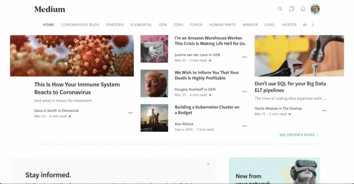

# Medium Stats Scraper
[](https://circleci.com/gh/otosky/medium_stats)
[](https://codecov.io/gh/otosky/medium_stats)

A command-line tool and Python package to fetch your Medium profile statistics 
and save the data as JSON.

*Executes the same API and Graphql requests as the Medium front-end does, providing 
you with the data as it is, pre-rendered.*

## Install

```bash
$ pip install medium-stats
```

## Setup

### Step 1

To make authenticated requests to Medium for your stats, the CLI tool 
needs **two** cookies from a signed-in Medium session - "sid" and "uid".

*If you want to manually find and store your cookies:*

- Sign in to Medium
- Get to your browser's developer tools and find the tab that holds cookies:
  - *Application* for Chrome 
  - *Storage* for Firefox
- Scroll through the cookies for medium.com until you find 'sid' and 'uid'




Create a `.medium_creds.ini` file to hold these cookie values:

```bash
cat > path_to_directory/.medium_creds.ini << EOF
[your_medium_handle_here]
sid=insert_sid_value_here
uid=insert_uid_value_here
EOF

#Note: the default behavior of the package will search your home directory for 
#this file, but you are welcome to set it to whatever directory you like and 
#pass that path as an argument to the CLI tool.

#Note: your Medium "handle" is your Medium username without the "@" prefix,
#e.g. "olivertosky" from https://medium.com/@olivertosky
```

***

*If you want to automatically find and store your cookies:*

```bash
$ pip install medium-stats[selenium]
```

This installs some extra dependencies allowing a webscraper to authenticate to Medium
on your behalf and grab your "sid" and "uid" cookies.  *Note: You must already have 
Chrome installed.*

Currently only valid for Gmail OAuth:

```bash
$ medium-stats fetch_cookies -u [HANDLE] --email [EMAIL] --pwd [PASSWORD]

# Or specify that your password should be pulled from an environment variable:
$ export MEDIUM_AUTH_PWD='[PASSWORD]'
$ medium-stats fetch_cookies -u [HANDLE] --email [EMAIL] --pwd-in-env
```

### Step 2 - *Optional*:

Create a directory for your stats exports; the CLI tool will run 
under the working directory by default.

```bash
$ mkdir path_to_target_stats_directory
```

Once executed the CLI tool will create the following directory structure:
```
target_stats_directory/
    stats_exports/
        [HANDLE]/
            agg_stats/ 
            agg_events/ 
            post_events/
            post_referrers/
```

## Usage
### Command-Line

Simple Use: 

```bash
$ medium-stats scrape_user -u [USERNAME] --all
```

> This will get all Medium stats for a user until now. 


For a publication:
```bash
$ medium-stats scrape_publication -u [USERNAME] -s [SLUG] --all

# The "slug" parameter is typically your publication's name in lower-case,
# with spaces delimited by dashes, and is the portion of your page's URL after "medium.com/"
# e.g. "test-publication" if the URL is https://medium.com/test-publication and name is "Test Publication"

```

General Use pattern:
```bash
medium-stats (scrape_user | scrape_publication) -u USERNAME/URL -s [PUBLICATION_SLUG]
[--output_dir DIR] (--creds PATH | (--sid SID --uid UID)) \
(--all | [--start PERIOD_START] [--end PERIOD END]) [--is-utc] \
[--mode {summary, events, articles, referrers, story_overview}]
```
FLAGS:

| flag         |                      function                     |                        default |
|--------------|:-------------------------------------------------:|---------------------------------------------:|
| --all        | gets all stats until now |                        |
| --end        |    end of period for stats fetched [exclusive]    | now (UTC) |
| --start      | beginning of period for stats fetched [inclusive] | --end minus 1 day @midnight |
| --is-utc     | whether start/stop are already in UTC time        | False |
| --output-dir |          directory to hold stats exports          | current working directory |
| --creds      |              path to credentials file             | ~/.medium_stats.ini |
| --sid        |          your Medium session id from cookie       |
| --uid        |          your Medium user id from cookie          |
| --mode       |       limits retrieval to particular statistics   | ['summary', 'events', 'articles', 'referrers'] for scrape_user|
|              |                  | ['events', 'story_overview', 'articles', 'referrers'] for scrape_publication

### Python

Basic Usage:
```python
#### SETUP ####
from datetime import datetime

start = datetime(year=2020, month=1, day=1)
stop = datetime(year=2020, month=4, day=1)
```

```python
#### FOR A USER ####
from medium_stats.scraper import StatGrabberUser

# get aggregated summary statistics; note: start/stop will be converted to UTC
me = StatGrabberUser('username', sid='sid', uid='uid', start=start, stop=stop)
data = me.get_summary_stats()

# get the unattributed event logs for all your stories:
data_events = me.get_summary_stats(events=True)

# get individual article statistics
articles = me.get_article_ids(data) # returns a list of article_ids

article_events = me.get_all_story_stats(articles) # daily event logs
referrers = me.get_all_story_stats(articles, type_='referrer') # all-time referral sources
```

```python
#### FOR A PUBLICATION ####
from medium_stats.scraper import StatGrabberPublication

# first argument should be your publication slug, i.e. what follows the URL after "medium.com/"
pub = StatGrabberPublication('test-publication', 'sid', 'uid', start, stop)

# get publication views & visitors (like the stats landing page)
views = pub.get_events(type_='views')
visitors = pub.get_events(type_='visitors')

# get summary stats for all publication articles
story_stats = pub.get_all_story_overview()

# get individual article statistics
articles = pub.get_article_ids(story_stats)

article_events = pub.get_all_story_stats(articles)
referrers = pub.get_all_story_stats(articles, type_='referrer')

# Note: if you want to specify naive-UTC datetimes, set already_utc=True in the class instantiation to
# avoid offset being applied.  Better practice is to just input tz-aware datetimes to "start" & "stop"
# params in the first place...
```

Note: "summary_stats" and "referrer" data pre-aggregates to your full history, 
i.e. they don't take into account "start" & "stop" parameters.

#### Example output:
`data` (summary):
```
[   {   'claps': 3,
        'collectionId': '',
        'createdAt': 1570229100438,
        'creatorId': 'UID',
        'firstPublishedAt': 1583526956495,
        'friendsLinkViews': 46,
        'internalReferrerViews': 17,
        'isSeries': False,
        'postId': 'ARTICLE_ID',
        'previewImage': {   'id': 'longstring.png',
                            'isFeatured': True,
                            'originalHeight': 311,
                            'originalWidth': 627},
        'readingTime': 7,
        'reads': 67,
        'slug': 'this-will-be-a-title',
        'syndicatedViews': 0,
        'title': 'This Will Be A Title',
        'type': 'PostStat',
        'updateNotificationSubscribers': 0,
        'upvotes': 3,
        'views': 394,
        'visibility': 0},
        ...
```

`data_events`:
```
[{  'claps': 0,
    'flaggedSpam': 0,
    'reads': 0,
    'timestampMs': 1585695600000,
    'updateNotificationSubscribers': 0,
    'upvotes': 0,
    'userId': 'UID',
    'views': 1},
        ...
```

`article_events`:
```
{'data': {
    'post': [{
        '__typename': 'Post',
        'dailyStats': [
            {   '__typename': 'DailyPostStat',
                'internalReferrerViews': 1,
                'memberTtr': 119,
                'periodStartedAt': 1583452800000,
                'views': 8},
            ... 
            {   '__typename': 'DailyPostStat',
                'internalReferrerViews': 5,
                'memberTtr': 375,
                'periodStartedAt': 1583539200000,
                'views': 40}],
        'earnings': {
            '__typename': 'PostEarnings',
            'dailyEarnings': [],
            'lastCommittedPeriodStartedAt': 1585526400000},
        'id': 'ARTICLE_ID'},
        ...
    ]}
}
```

`referrers`:
```
{'data': {'post': [{'__typename': 'Post',
                    'id': 'POST_ID',
                    'referrers': [{'__typename': 'Referrer',
                                   'internal': None,
                                   'platform': None,
                                   'postId': 'POST_ID',
                                   'search': None,
                                   'site': None,
                                   'sourceIdentifier': 'direct',
                                   'totalCount': 222,
                                   'type': 'DIRECT'},
                                  ...
                                  {'__typename': 'Referrer',
                                   'internal': None,
                                   'platform': None,
                                   'postId': 'POST_ID',
                                   'search': None,
                                   'site': {'__typename': 'SiteReferrer',
                                            'href': 'https://www.inoreader.com/',
                                            'title': None},
                                   'sourceIdentifier': 'inoreader.com',
                                   'totalCount': 1,
                                   'type': 'SITE'}],
                    'title': 'TITLE_HERE',
                    'totalStats': {'__typename': 'SummaryPostStat',
                                   'views': 395}},
                    ...
                   ]
            }
}
```

> If you set up your credentials file already, there is a helper class `MediumConfigHelper`,
that wraps the standard `configparser`:
```python
import os
from medium_stats.cli import MediumConfigHelper

default_creds = os.path.join(os.path.expanduser('~'), '.medium_creds.ini')

cookies = MediumConfigHelper(config_path=default_creds, account_name='your_handle')
sid = cookies.sid
uid = cookies.uid
```

TODO:
- Add story author and title to post stats
